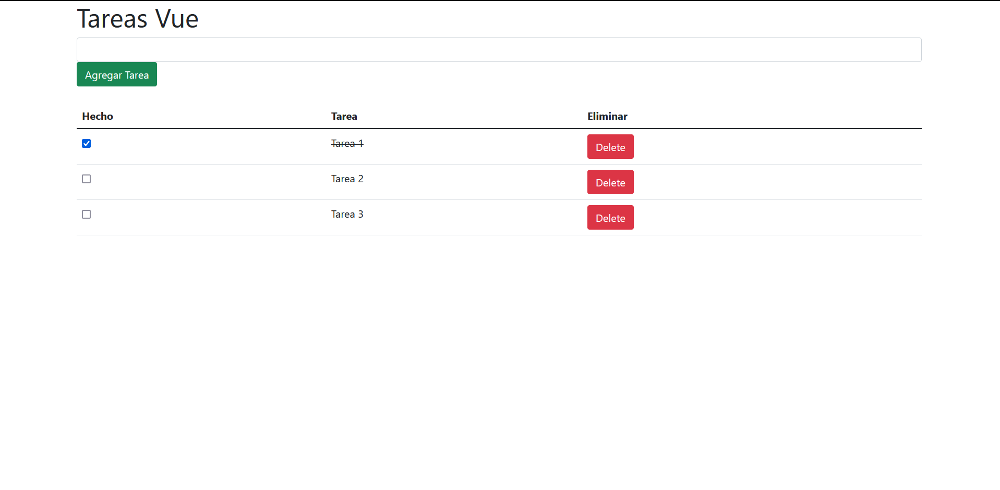

# Detalles de la aplicación Tareas Vue
## Descripción
Esta es una aplicación sencilla de una agenda de tareas donde se pueden agregar y elimar tareas, fue desarrollado en un documento HTML, la libreria Vue utilizada para este proyecto corresponde a la version Vue 2. 

